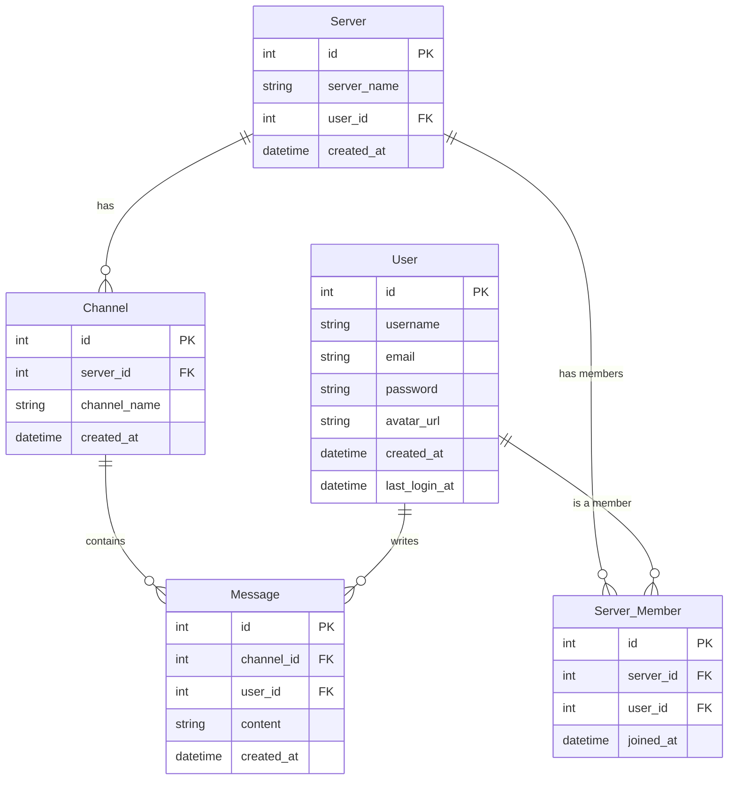

```mermaid
erDiagram
  Server {
      int id PK
      string server_name
      int user_id FK
      datetime created_at
  }
  Channel {
      int id PK
      int server_id FK
      string channel_name
      datetime created_at
  }
  User {
      int id PK
      string username
      string email
      string password
      string avatar_url
      datetime created_at
      datetime last_login_at
  }
  Message {
      int id PK
      int channel_id FK
      int user_id FK
      string content
      datetime created_at
  }
  Server_Member {
      int id PK
      int server_id FK
      int user_id FK
      datetime joined_at
  }

  Server ||--o{ Channel : "has"
  Server ||--o{ Server_Member : "has members"
  User ||--o{ Server_Member : "is a member"
  Channel ||--o{ Message : "contains"
  User ||--o{ Message : "writes"
```